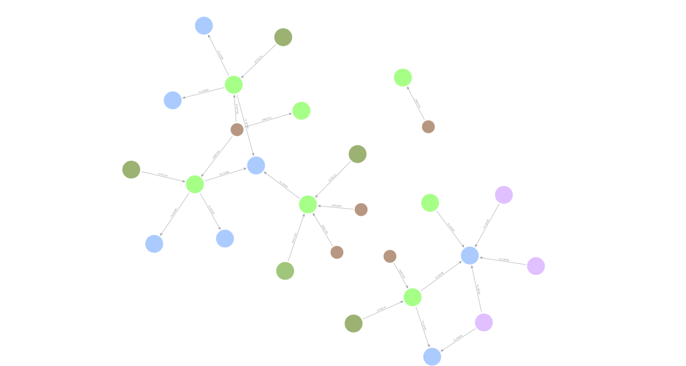
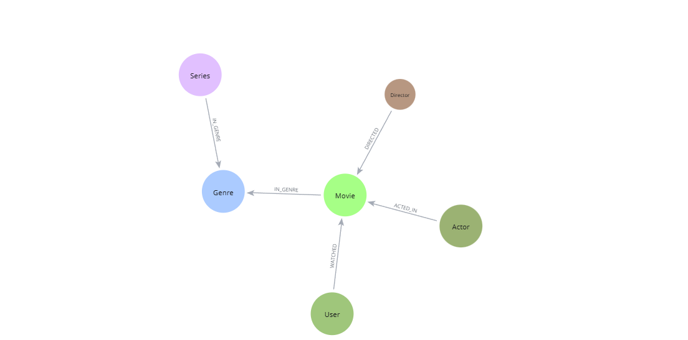

# 🎞️ Graph Database de Filmes e Séries com Neo4j 

## Descrição
Este projeto implementa um banco de dados de grafos para filmes e séries usando **Neo4j** e a línguagem **Cypher**. O modelo inclui usuários, filmes, séries, atores, diretores e gêneros, com relacionamentos como `ACTED_IN`, `DIRECTED`, `WATCHED` e `IN_GENRE`.

## Objetivo 
Demonstar na prática como modelar dados complexos e interconectados em grafos, explorando consultas avançadas que seriam complexas em bancos relacionais.

## Modelo de Dados 

### Entidades (Nós)
- **User** (10 usuários) - nome, email, idade, localização
- **Movie** (26 filmes) - título, ano, avaliação IMDB, sinopse
-- **Series** (14 séries) - título, ano, temporadas, avaliação IMDB
- **Actor** (15 atores) - nome, ano de nascimento, nacionalidade
- **Director** (15 diretores) -nome, ano de nascimento, nacionalidade 
- **Genre** (12 gêneros) - nome

### Relacionamentos (Arestas)
- `(:User)-[:WATCHED {rating, date, review}]->(:Movie|:Series)`
- `(:Actor)-[:ACTED_IN {role}]->(:Movie|:Series)`
- `(:Director)-[:DIRECTED]->(:Movie|:Series)`
- `(:Movie|:Series)-[:IN_GENRE]->(:Genre)`

### Diagrama do Modelo 

## Como Executar o Projeto 

### Pré-requisitos 
-[Neo4j Desktop](https://neo4j.com/download/) ou [Neo4j AuraDB Free](https://neo4j.com/cloud/aura-free)
- (Opcional) Cliente Cypher como Neo4j Browser

### Passo a Passo

1. **Clone o repositório**